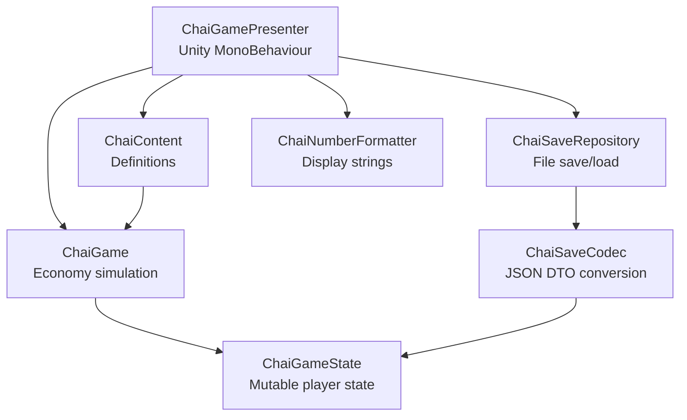
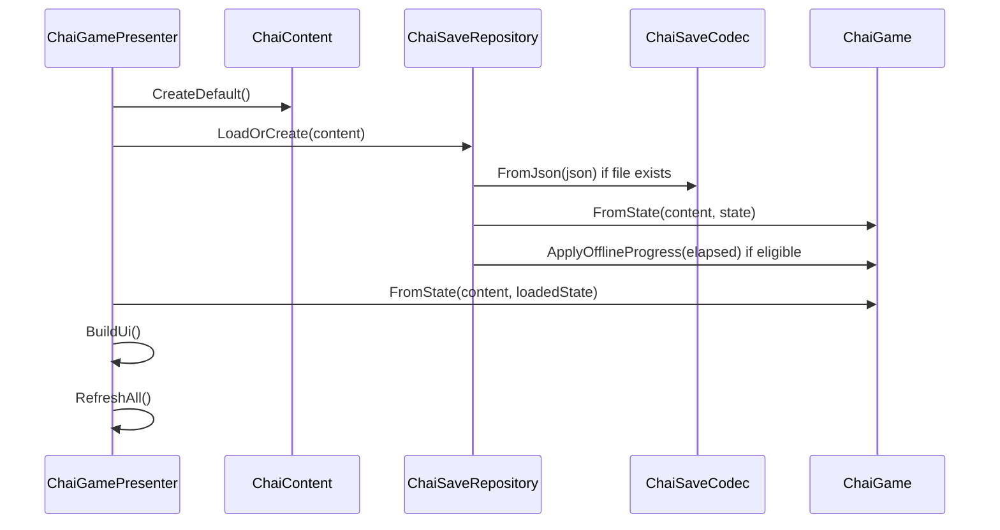
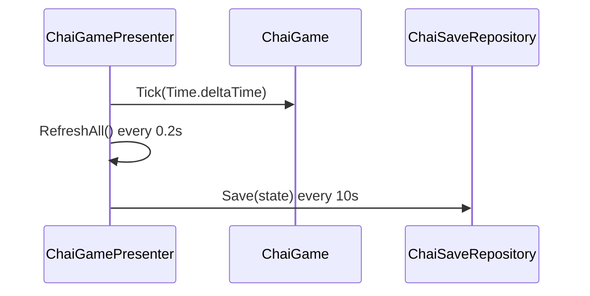

# System Design

This document explains the current Unity architecture and how to extend it safely.

## Architecture Overview



## Assembly Layout

| Assembly | Path | Purpose |
| --- | --- | --- |
| `ChaiEmpire.Runtime` | `Assets/ChaiEmpire/Runtime/ChaiEmpire.Runtime.asmdef` | Runtime game, economy, save, and UI code. |
| `ChaiEmpire.Editor` | `Assets/ChaiEmpire/Editor/ChaiEmpire.Editor.asmdef` | Editor-only scene and Android build helpers. |
| `ChaiEmpire.Tests.EditMode` | `Assets/ChaiEmpire/Tests/EditMode/ChaiEmpire.Tests.EditMode.asmdef` | Edit-mode tests. |

Runtime references `UnityEngine.UI`. Tests reference runtime.

## Runtime Systems

### ChaiContent

Path: `Assets/ChaiEmpire/Runtime/ChaiContent.cs`

Responsibilities:

- Own all current content definitions.
- Provide lookup by upgrade ID.
- Provide lookup by location ID.
- Store global content constants:
  - Offline efficiency.
  - Offline cap seconds.
  - Prestige unlock rupees.

Important types:

- `ChaiContent`
- `UpgradeDefinition`
- `LocationDefinition`
- `UpgradeKind`

Current limitation:

- Content is hard-coded in C#.

Recommended future:

- Move content to ScriptableObjects, JSON, CSV, or Google Sheet export.
- Preserve the same fields and formulas so tests remain meaningful.

### ChaiGame

Path: `Assets/ChaiEmpire/Runtime/ChaiGame.cs`

Responsibilities:

- Own gameplay rules.
- Calculate tap value.
- Calculate passive income.
- Apply manual taps.
- Apply queue serving.
- Advance time.
- Trigger Rush Hour.
- Buy upgrades.
- Unlock locations.
- Apply offline progress.
- Generate prestige preview.

Important methods:

| Method | Role |
| --- | --- |
| `NewGame(content)` | Creates a game with new state. |
| `FromState(content, state)` | Creates a game around loaded state. |
| `GetTapValue()` | Calculates active tap earning. |
| `GetPassiveRupeesPerSecond()` | Calculates current passive rate. |
| `TapKettle(taps)` | Applies manual kettle earnings. |
| `TapCustomerQueue()` | Applies queue-serving earnings. |
| `Tick(deltaSeconds)` | Advances passive income and timers. |
| `TryTriggerRushHour()` | Starts Rush Hour if available. |
| `TryBuyUpgrade(id)` | Purchases upgrade if possible. |
| `TryUnlockLocation(id)` | Unlocks location if possible. |
| `ApplyOfflineProgress(elapsed)` | Applies capped offline reward. |
| `GetPrestigePreview()` | Returns future-prestige readiness. |

Design rule:

- Keep economy rules here, not in UI code.

### ChaiGameState

Path: `Assets/ChaiEmpire/Runtime/ChaiGameState.cs`

Responsibilities:

- Store mutable player state.
- Store upgrade levels.
- Store unlocked locations.
- Store prestige fields.
- Provide helpers for upgrade/location lookups.

Important fields:

- `SaveVersion`
- `Rupees`
- `TotalLifetimeRupees`
- `ChaiServed`
- `LastSavedUtcTicks`
- `RushRemainingSeconds`
- `RushCooldownSeconds`
- `Prestige`
- `UpgradeLevels`
- `UnlockedLocations`

Design rule:

- State should contain data, not economy rules.

### ChaiSaveCodec

Path: `Assets/ChaiEmpire/Runtime/ChaiSaveCodec.cs`

Responsibilities:

- Convert `ChaiGameState` to JSON.
- Convert JSON back to `ChaiGameState`.
- Serialize `BigDouble` as strings.
- Ensure `gali-tapri` is unlocked after load.
- Default invalid/blank JSON to a new state.

Design rule:

- Keep DTO fields explicit so save migrations are possible.

### ChaiSaveRepository

Path: `Assets/ChaiEmpire/Runtime/ChaiSaveRepository.cs`

Responsibilities:

- Decide save file path.
- Read save file if it exists.
- Create new state if no save exists.
- Apply offline reward on load.
- Write save file.

Save path:

```text
Application.persistentDataPath/chai-empire-save.json
```

Design rule:

- Repository handles file I/O; codec handles JSON shape.

### ChaiNumberFormatter

Path: `Assets/ChaiEmpire/Runtime/ChaiNumberFormatter.cs`

Responsibilities:

- Format rupees as `Rs <compact>`.
- Format rates as `Rs <compact>/sec`.
- Format large values with suffixes.

Current suffixes:

```text
K, M, B, T, Qa, Qi, Sx, Sp, Oc, No, Dc
```

### ChaiGamePresenter

Path: `Assets/ChaiEmpire/Runtime/ChaiGamePresenter.cs`

Responsibilities:

- Force portrait orientation.
- Set target frame rate to 60.
- Load or create game state.
- Build runtime UI.
- Wire buttons to game actions.
- Refresh UI every 0.2 seconds.
- Auto-save every 10 seconds.
- Save on pause and quit.

Current UI sections:

- Header.
- Stats.
- Actions.
- Upgrades.
- Locations.
- Prestige preview.

Design rule:

- Presenter can render and call public game methods, but should not duplicate formulas.

## Editor Systems

### ChaiEmpireSceneBuilder

Path: `Assets/ChaiEmpire/Editor/ChaiEmpireSceneBuilder.cs`

Responsibilities:

- Create an empty scene.
- Add a main camera.
- Add `ChaiGamePresenter`.
- Save scene to `Assets/ChaiEmpire/Scenes/ChaiEmpire.unity`.
- Add the scene to build settings.
- Set company/product/orientation settings.

Menu item:

```text
Chai Empire/Rebuild Main Scene
```

### ChaiEmpireBuild

Path: `Assets/ChaiEmpire/Editor/ChaiEmpireBuild.cs`

Responsibilities:

- Rebuild main scene.
- Switch active build target to Android.
- Set build output to `ChaiEmpire.apk`.
- Set Android application identifier to `com.taprilabs.chaiempire`.
- Build Android APK.

Batch method:

```text
ChaiEmpire.Editor.ChaiEmpireBuild.BuildAndroid
```

## Data Flow

### App Start



### Runtime Update



## Extension Points

| Future need | Best extension point |
| --- | --- |
| ScriptableObject content | Replace or supplement `ChaiContent.CreateDefault()`. |
| More upgrade kinds | Add `UpgradeKind` values and handle them in `ChaiGame`. |
| Skill tree effects | Add skill definitions and include effects in multiplier formulas. |
| Events | Extend `ChaiEvents`, `EventState`, and event multiplier helpers in `ChaiGame`. |
| Analytics | Add event emission in presenter after successful actions. |
| Cloud save | Add another repository implementation or sync layer above `ChaiSaveRepository`. |
| Better UI | Replace runtime UI construction while keeping `ChaiGame` API. |
| Anti-cheat | Add server time or trusted clock checks around offline reward. |

## System Boundaries

Do:

- Keep content definitions separate from player state.
- Keep formula logic in `ChaiGame`.
- Keep save JSON conversion in `ChaiSaveCodec`.
- Keep file I/O in `ChaiSaveRepository`.
- Keep UI-specific code in `ChaiGamePresenter`.

Avoid:

- Reading/writing save files directly from economy code.
- Putting balance constants inside button handlers.
- Adding new save fields without documenting migration.
- Making UI text the only source of mechanic truth.
