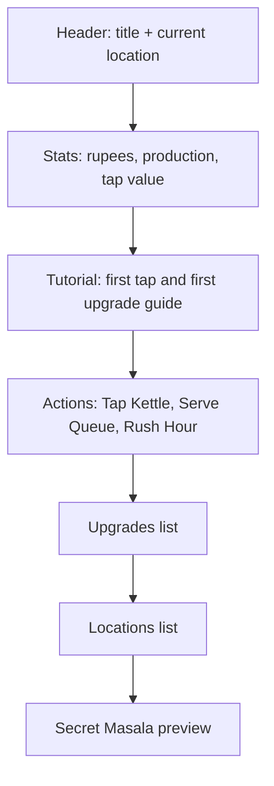

# UI And UX For Android

This document defines the current Android UI and future UX rules.

## Current UI Status

Current UI is built at runtime by `ChaiGamePresenter`. The saved scene contains a camera and the app object; the presenter creates the canvas, scroll view, panels, text, and buttons on start.

Current characteristics:

- Portrait orientation.
- One scrollable screen.
- Large tap targets.
- Unity `Canvas` in Screen Space Overlay mode.
- `CanvasScaler` reference resolution `1080 x 1920`.
- Scroll view margins: 24 px on all sides.
- Main content uses vertical layout with 16 px spacing.
- UI refresh cadence: every 0.2 seconds.
- Save cadence: every 10 seconds.

## Screen Structure

Current screen order:

1. Header.
2. Stats.
3. Tutorial guide, shown until the first upgrade is bought.
4. Actions.
5. Upgrades.
6. Locations.
7. Prestige preview.



## Current Visual Palette

| Name | RGB float values | Use |
| --- | --- | --- |
| Background | `0.05, 0.16, 0.17` | Page background and camera color. |
| Panel | `0.96, 0.93, 0.84` | Main card/panel backgrounds. |
| Ink | `0.08, 0.11, 0.12` | Main dark text. |
| Saffron | `0.93, 0.43, 0.16` | Primary action. |
| Teal | `0.07, 0.43, 0.43` | Header and upgrade buttons. |
| Leaf | `0.18, 0.50, 0.31` | Queue/location action. |
| Rose | `0.65, 0.17, 0.27` | Rush/prestige/status accent. |
| Disabled | `0.45, 0.48, 0.48` | Disabled buttons. |

## Current UI Sections

### Header

Height: 170.

Shows:

- `Chai Empire`
- Current highest unlocked location.
- Current demand multiplier.

### Stall Art

Height: 360.

Shown directly below the header.

Runtime objects:

| Object | Purpose |
| --- | --- |
| `Stall Art` | Warm tapri art panel. |
| `Kettle Body` and `Kettle Belly` | Main chai kettle silhouette. |
| `Kettle Spout` and `Kettle Handle Outer` | Readable kettle details. |
| `Stove Base`, `Burner Ring`, `Flame Outer`, `Flame Inner` | Stove and active flame. |

The current art is procedural Unity UI geometry generated by `ChaiGamePresenter`, with no imported texture files.

### Stats

Height: 250.

Shows:

- Current rupees.
- Production per second.
- Kettle tap value.
- Chai served.
- Masala Legacy.

### Actions

Height: 320.

Buttons:

| Button | Current action |
| --- | --- |
| Tap Kettle | Calls `game.TapKettle()`. |
| Serve Queue | Calls `game.TapCustomerQueue()`. |
| Rush Hour | Calls `game.TryTriggerRushHour()`. |

Rush text shows one of:

- `Rush active <seconds> sec`
- `Rush ready in <seconds> sec`
- `Rush ready`

### Tutorial

Height: 250 when visible.

Shown only before `Strong Tea Leaves` has been bought.

Guided states:

| State | Player-facing guide | Primary button |
| --- | --- | --- |
| Fresh save | `Brew your first chai` | `Tap Kettle` |
| After first tap, before `Rs 10` | `Save for Strong Tea Leaves` | `Tap Kettle` |
| At `Rs 10` before first upgrade | `First upgrade ready` | `Buy Strong Tea` |

The tutorial hides after the first `Strong Tea Leaves` purchase. It is derived from current game state and does not add save fields.

### Offline Reward Modal

Shown on launch only when `LoadResult.HasOfflineReward` is true.

Fields:

| Field | Text source |
| --- | --- |
| Reward amount | `LoadResult.OfflineReward.RupeesEarned` |
| Away time | `OfflineReward.RawSeconds` |
| Efficiency | `ChaiContent.OfflineEfficiency` |
| Cap | `OfflineReward.CappedSeconds` or `ChaiContent.OfflineCapSeconds` |

The `Claim` button only dismisses the modal; the reward has already been applied during load.

### Upgrades

Shows all current upgrades.

Each button displays:

```text
<Display Name> Lv <level>
<Category> | <Effect>
Cost Rs <cost>
```

Button is interactable if the player has enough rupees.

### Locations

Shows all non-default locations.

Each button displays:

```text
<Display Name>
Demand x<multiplier> | <Unlocked or Cost>
```

Button is interactable if locked and affordable.

### Prestige

Shows:

- Section title `Secret Masala`.
- Prestige readiness message.
- Projected legacy amount.
- Temporary status messages.

Current prestige is preview-only.

### Settings

Current settings include a local save reset button.

Reset behavior:

1. First tap changes the button to `Confirm Reset`.
2. Confirmation expires after 6 seconds.
3. Second tap deletes the local save file, creates a fresh game state, saves it, and refreshes the UI.

## One-Thumb Interaction Rules

Future UI should preserve:

- Primary tap target should be large and near the thumb-friendly lower half when possible.
- Critical production stats should remain visible without excessive scrolling.
- Upgrade buttons should be tall enough for comfortable tapping.
- Disabled buttons must clearly look disabled.
- Button text must wrap or resize rather than overflow.
- Do not rely on hover or keyboard input.

## Feedback Rules

Every important action should have immediate feedback.

| Action | Current feedback |
| --- | --- |
| Tap Kettle | Status message `Fresh cutting chai`. |
| Serve Queue | Status message `Queue served`. |
| Buy upgrade | Status message `<Upgrade> upgraded`. |
| Unlock location | Status message `<Location> unlocked`. |
| Trigger Rush Hour | Status message `Rush hour: 2x for 20 sec`. |
| Return after offline reward | Offline reward modal plus status message `Welcome back: Rs <amount>`. |
| Tutorial primary tap | Same feedback as the action it performs. |
| Reset save | Two-step confirmation and status message `Save reset`. |

Future polish:

- Add subtle button scale animation.
- Add floating rupee text.
- Add kettle steam animation.
- Add queue/customer animation.
- Add sound for tap, purchase, unlock, and rush.
- Add haptics for major unlocks.

## Mobile Readability Rules

- Use large numeric text for rupees.
- Keep labels short.
- Prefer compact number formatting after 1,000.
- Keep longest button labels readable at 1080 x 1920 and lower Android resolutions.
- Test with Android font scaling if possible.
- Do not show dense multi-column tables in runtime UI.

## Runtime Performance Rules

Current runtime UI is simple, but future versions should:

- Avoid rebuilding the full upgrade list every frame.
- Refresh dynamic text at a fixed cadence, not every frame.
- Pool floating text effects.
- Keep particle effects lightweight.
- Avoid large transparent full-screen overlays on low-end Android devices.
- Keep textures compressed for Android.
- Profile before adding expensive animations.

## Future UI Screens

Planned/future:

| Screen | Purpose |
| --- | --- |
| Main Stall | Current screen, refined with art and animation. |
| Upgrades Tab | Better upgrade grouping and sorting. |
| Locations Map | Visual expansion path across locations. |
| Offline Reward Modal | Clear return reward summary. |
| Prestige Screen | Reset preview, confirmation, and skill tree. |
| Settings | Audio, haptics, privacy, reset save. |
| Events | Festival or timed event progress. |
| Cosmetics | Stall themes, cups, signboards. |

## Android-Specific UX

- Back button should open settings or confirm exit, not instantly quit during important moments.
- App pause should save immediately. This is already implemented.
- Offline reward should appear only after meaningful absence. Current threshold is 30 seconds.
- Avoid requiring precise taps.
- Do not hide important buttons behind device cutouts or navigation bars.
- Test portrait only; landscape is disabled by scene builder settings.
